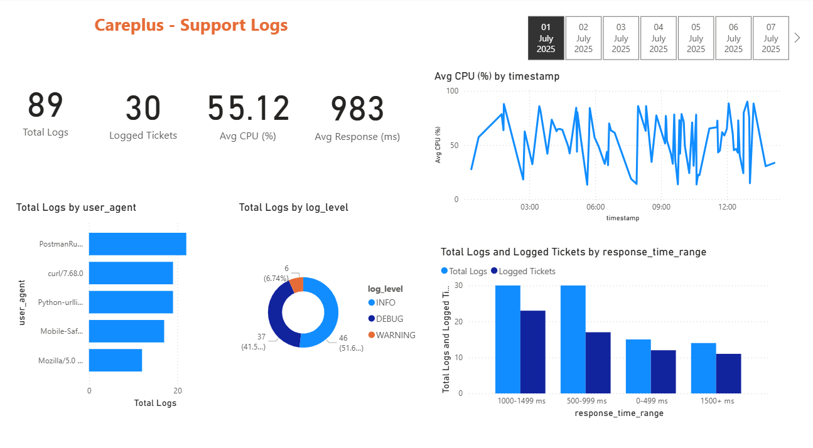
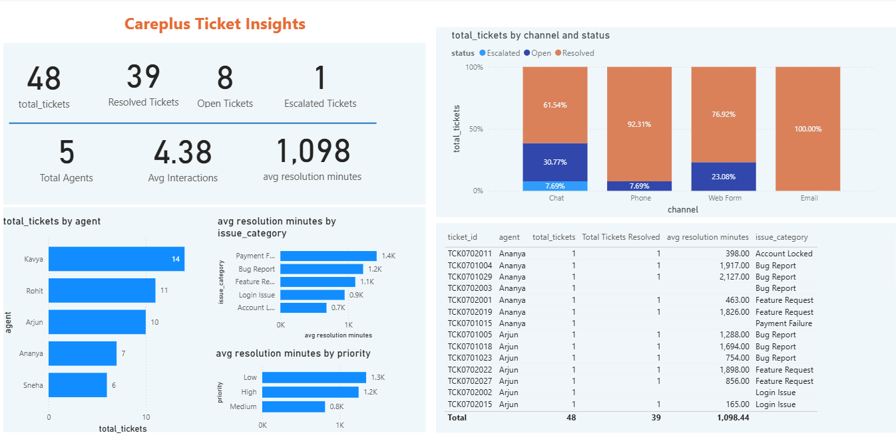

# AWS Data Engineering Pipeline for Support Ticket Analytics

---

## Overview

This project implements a fully automated end-to-end AWS-based data engineering pipeline to process OLTP support ticket data and generate operational insights.

The pipeline ingests raw ticket logs into an Amazon S3 Data Lake, performs serverless data transformation using AWS Lambda and AWS Glue, loads structured datasets into Amazon Redshift, and powers interactive Power BI dashboards for analytics.

The solution demonstrates full ETL lifecycle management including ingestion, transformation, warehousing, and visualization.

---

## Architecture

The pipeline follows a modern serverless data architecture:

OLTP Source → S3 Data Lake → Lambda / Glue Transformations → Redshift Warehouse → Power BI

### Architecture Diagram

---

## Core Components

- Data ingestion into S3 Data Lake
- Serverless transformation using AWS Lambda
- Automated ETL using AWS Glue
- Incremental and full data load handling
- Redshift-based cloud data warehouse
- SQL-based analytics queries
- Power BI dashboards for business insights

---

## Data Flow

### 1️) Ingestion Layer
- Extracted OLTP support ticket data
- Stored raw structured data in Amazon S3
- Organized into raw and processed zones

### 2️) Transformation Layer
- Used AWS Lambda for lightweight processing
- Used AWS Glue for scalable ETL transformations
- Implemented incremental load logic
- Cleaned and standardized timestamp and categorical fields

### 3️) Warehousing Layer
- Loaded processed Parquet datasets into Amazon Redshift
- Designed analytics-ready tables
- Supported ad-hoc SQL queries using Redshift & Athena

### 4) Analytics & Visualization
- Connected Power BI to Redshift
- Built operational dashboards for support performance monitoring

---

## Dashboard Preview

### Support Logs Overview

Key Metrics:
- Total Logs
- Logged Tickets
- Average CPU Usage
- Average Response Time
- Log distribution by level
- Response time analysis

---

### Ticket Insights Dashboard

Key Metrics:
- Total Tickets
- Resolved vs Open Tickets
- Escalated Tickets
- Average Resolution Time
- Ticket distribution by channel
- Agent performance analysis

---

## Key Features

- Serverless ETL architecture
- Incremental and full load handling
- Data lake to warehouse integration
- Parquet-based optimized storage
- Redshift SQL analytics
- Power BI operational dashboards
- Cloud-native scalable design

---

## Tech Stack

- Amazon S3
- AWS Lambda
- AWS Glue
- Amazon Redshift
- AWS Athena
- Python
- SQL
- Power BI
- Serverless Architecture

---

## Business Impact

- Centralized support log and ticket data
- Reduced manual reporting effort
- Improved SLA monitoring visibility
- Enabled real-time operational insights
- Provided performance tracking across agents and channels

---

## How to Run

1. Create S3 bucket for raw and processed data
2. Deploy Lambda function for ingestion
3. Configure Glue ETL jobs
4. Create Redshift database and tables
5. Load transformed data
6. Connect Power BI to Redshift
7. Build dashboards

